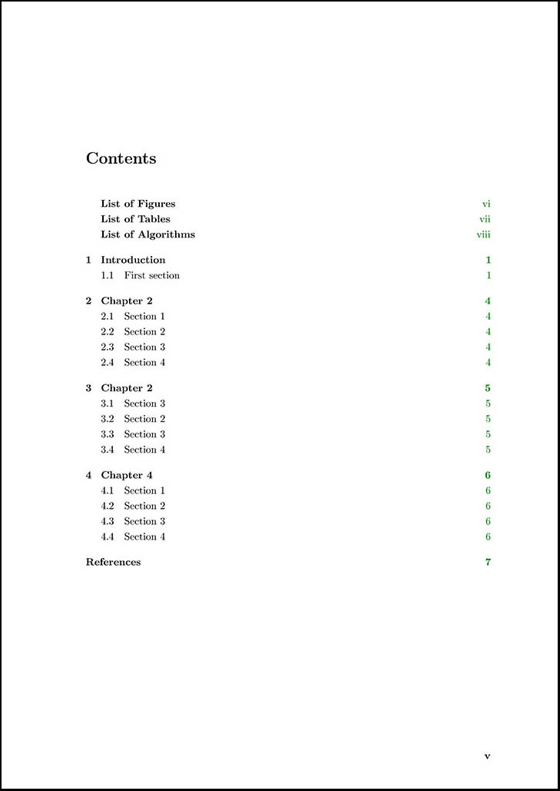

# SPhdThesis #
SPhdThesis is a latex document class for writing PhD thesis. I developed it while writing my PhD thesis in School of Computing (SoC), National University of Singapore (NUS). By default, it adheres to the “NUS Guidelines on Format of Research Thesis Submitted For Examination” located at http://www.nus.edu.sg/registrar/event/gdthesisexam.html. However, it is quite easy to change it for different guidelines.

## Downloading ##
You can download the latest version by clicking the ZIP button on the top of this page.

## Getting started ##
The easiest way start using SPhdThesis is to copy the example folder and modify `thesis.tex`. `figure.tex`, `table.tex`, `algorithm.tex` shows how to format figures, tables, and algorithms, respectively. `thesis.pdf` shows how a thesis looks like using SPhdThesis document class. For convenience, below are some screenshots showing how a thesis looks like.

For more details read `SPhdThesis.pdf`. It describes in detail how to use the document class and provide some hints on how to customize it. It also lists some some useful tools for working with latex.

## Getting Help ##
Either raise a issue here on GitHub or mail me at the email address given in the `SPhdThesis.cls` file. 

## Screenshots ##

<strong>Title Page</strong>

 

<strong>Declaration</strong>

 

<strong>Table of contents</strong>

 

<strong>Chapter title</strong>

 

<strong>Chapter Header and tables</strong>

 

<strong>Algorithms</strong>
